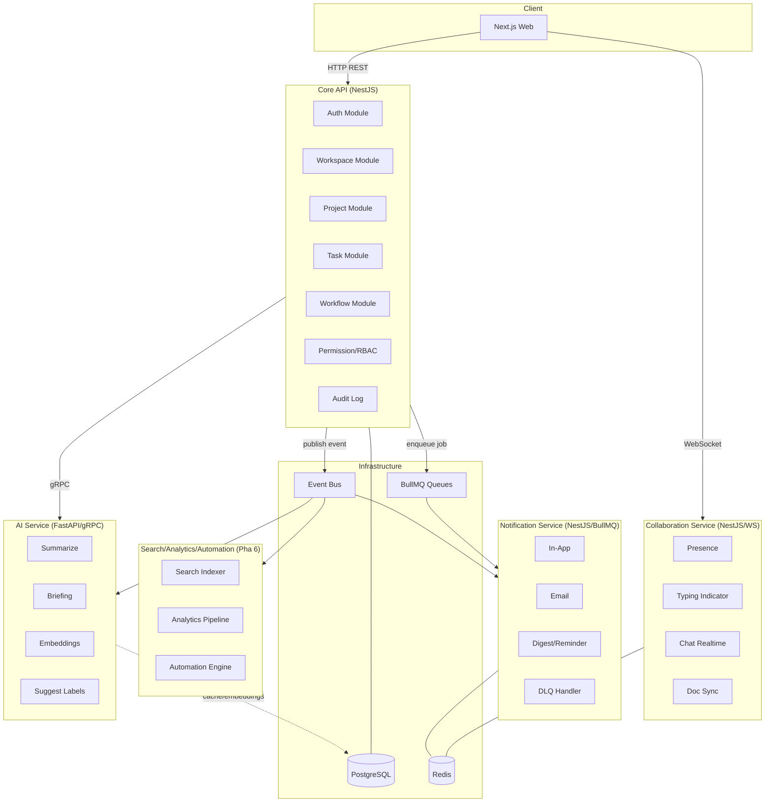
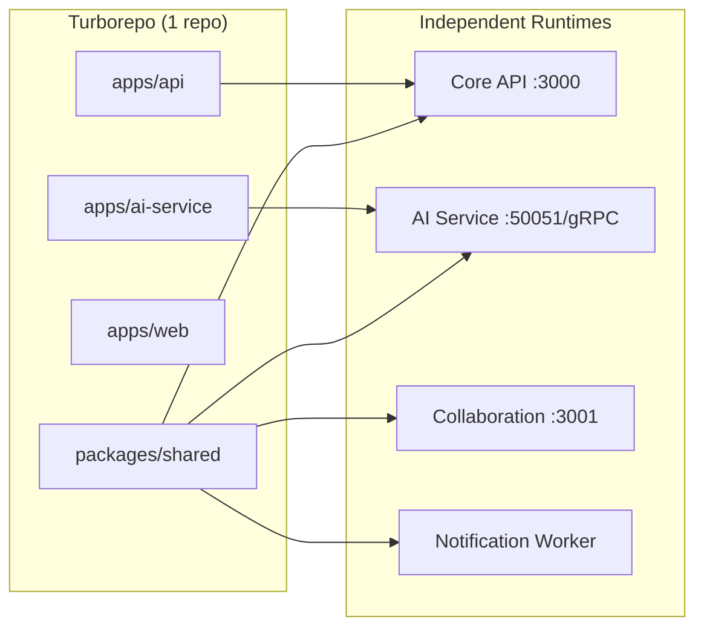
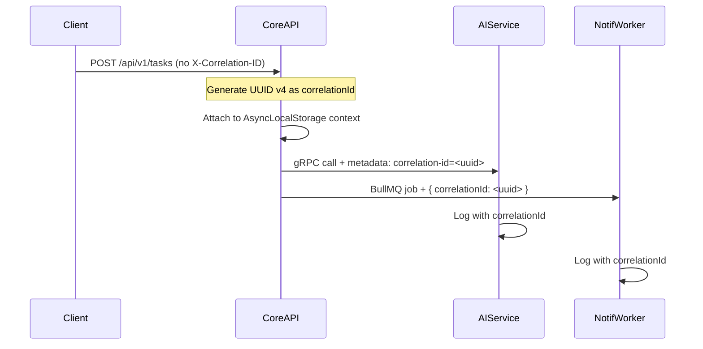
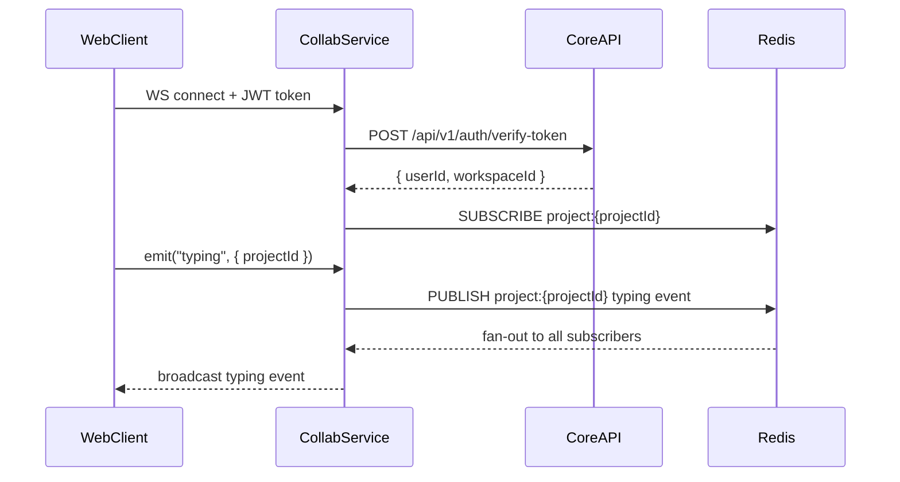

# Design Document: Microservice Transition

## Overview

SuperBoard là một Turborepo monorepo với NestJS Core API, Next.js web, FastAPI AI service, và các worker/gateway đang được tích hợp dần. Mục tiêu của kế hoạch này **không phải** là viết lại toàn bộ, mà là tách runtime theo service độc lập từng bước, giữ nguyên monorepo để chia sẻ contract, types, và build tooling.

Chiến lược thực hiện theo 5 Epic song song với 7 pha:

| Pha | Tên                              | Epic       |
| --- | -------------------------------- | ---------- |
| -1  | Ổn định maintainability          | A          |
| 0   | Microservice-ready foundation    | B          |
| 1   | Cố định contract                 | B          |
| 2   | Harden AI Service                | C          |
| 3   | Tách Collaboration Service       | C          |
| 4   | Tách Notification Service        | C          |
| 5   | Event-driven hóa luồng chéo      | D          |
| 6   | Tách Search/Analytics/Automation | D + future |

**Nguyên tắc cốt lõi:**

- 1 repo, nhiều service, tách runtime dần dần
- Core API giữ lâu hơn — không big-bang rewrite
- Không service nào query trực tiếp DB của service khác
- Mọi giao tiếp xuyên service phải có contract rõ ràng
- Luồng không cần phản hồi ngay → event/queue; cần phản hồi ngay → HTTP/gRPC

---

## Architecture

### Kiến trúc tổng thể (Target State)



### Giao tiếp giữa services

| Loại     | Kênh                             | Dùng cho                                 |
| -------- | -------------------------------- | ---------------------------------------- |
| Sync     | HTTP REST                        | Client → Core API                        |
| Sync     | gRPC                             | Core API → AI Service                    |
| Async    | BullMQ (Redis)                   | Core API → Notification jobs             |
| Async    | Event Bus (BullMQ/Redis pub-sub) | Domain events → AI, Notification, Search |
| Realtime | WebSocket (Socket.IO)            | Client → Collaboration Service           |

### Deployment topology



---

## Components and Interfaces

### Epic A — Ổn định Maintainability (Pha -1)

#### A1: Duplicate Code Baseline Report

**Công cụ:** `jscpd` (JS/TS copy-paste detector) tích hợp vào CI.

**Output format:**

```json
{
  "reportVersion": "1",
  "generatedAt": "ISO8601",
  "hotspots": [
    {
      "rank": 1,
      "group": "error-handling | mapper | validation | response",
      "files": ["path/to/file.ts"],
      "duplicateLines": 42,
      "impact": "high | medium | low",
      "consolidationDirection": "Extract to packages/shared/src/..."
    }
  ]
}
```

**Nhóm scan ưu tiên:**

- `validation`: Zod schemas, class-validator decorators lặp
- `mapper`: Entity → DTO transform logic
- `response`: `apiSuccess()` / error shaping ngoài filter
- `error-handling`: try/catch patterns, exception mapping

#### A2: ApiResponse Envelope Chuẩn hóa

Hiện tại `@superboard/shared` đã có `ApiResponse<T>` và `apiSuccess()` helper. Cần đảm bảo **100% endpoint** dùng đúng shape.

**Interface chuẩn (đã tồn tại, cần enforce):**

```typescript
// packages/shared/src/types/api-response.ts
interface ApiResponse<T> {
  success: boolean;
  data?: T;
  error?: {
    code: string; // domain error code, e.g. "TASK_NOT_FOUND"
    message: string;
    details?: unknown;
  };
  meta: {
    timestamp: string;
    correlationId?: string;
    trace?: string; // dev only
  };
}
```

**Success response:**

```json
{ "success": true, "data": { ... }, "error": null, "meta": { "timestamp": "..." } }
```

**Error response:**

```json
{ "success": false, "data": null, "error": { "code": "TASK_NOT_FOUND", "message": "..." }, "meta": { ... } }
```

#### A3: Error Code Catalog v1

**Cấu trúc error code:** `{DOMAIN}_{NOUN}_{VERB/STATE}`

```typescript
// packages/shared/src/errors/error-codes.ts
export const ErrorCodes = {
  // Auth domain
  AUTH_TOKEN_INVALID: 'AUTH_TOKEN_INVALID',
  AUTH_TOKEN_EXPIRED: 'AUTH_TOKEN_EXPIRED',
  AUTH_CREDENTIALS_INVALID: 'AUTH_CREDENTIALS_INVALID',
  AUTH_PERMISSION_DENIED: 'AUTH_PERMISSION_DENIED',

  // Workspace domain
  WORKSPACE_NOT_FOUND: 'WORKSPACE_NOT_FOUND',
  WORKSPACE_MEMBER_NOT_FOUND: 'WORKSPACE_MEMBER_NOT_FOUND',
  WORKSPACE_LIMIT_EXCEEDED: 'WORKSPACE_LIMIT_EXCEEDED',

  // Project domain
  PROJECT_NOT_FOUND: 'PROJECT_NOT_FOUND',
  PROJECT_MEMBER_NOT_FOUND: 'PROJECT_MEMBER_NOT_FOUND',
  PROJECT_ARCHIVED: 'PROJECT_ARCHIVED',

  // Task domain
  TASK_NOT_FOUND: 'TASK_NOT_FOUND',
  TASK_STATUS_INVALID: 'TASK_STATUS_INVALID',
  TASK_ASSIGNEE_NOT_MEMBER: 'TASK_ASSIGNEE_NOT_MEMBER',

  // Generic
  VALIDATION_FAILED: 'VALIDATION_FAILED',
  INTERNAL_ERROR: 'INTERNAL_ERROR',
  RATE_LIMIT_EXCEEDED: 'RATE_LIMIT_EXCEEDED',
} as const;
```

**Mapping tại `HttpExceptionFilter`:** Exception class → ErrorCode → HTTP status.

#### A4: Boundary Rules (ESLint)

Dùng `eslint-plugin-boundaries` hoặc custom ESLint rule để enforce:

**3 pattern bị chặn:**

1. Module A import trực tiếp service/repository của Module B (cross-domain service import)
2. Controller import repository trực tiếp (bypass service layer)
3. `packages/shared` import từ `apps/*` (shared không được phụ thuộc app)

**Config mẫu:**

```json
// .eslintrc boundary rules
{
  "rules": {
    "boundaries/element-types": [
      "error",
      {
        "default": "disallow",
        "rules": [
          { "from": "module", "allow": ["shared", "common"] },
          { "from": "controller", "allow": ["service", "dto"] },
          { "from": "shared", "allow": [] }
        ]
      }
    ]
  }
}
```

---

### Epic B — Microservice-Ready Foundation (Pha 0)

#### B1: Health Check Endpoints

Mỗi service expose 2 endpoints:

| Endpoint      | Mục đích                          | Response khi healthy                           |
| ------------- | --------------------------------- | ---------------------------------------------- |
| `GET /health` | Liveness — service còn sống       | `200 { status: "ok" }`                         |
| `GET /ready`  | Readiness — sẵn sàng nhận traffic | `200 { status: "ready", dependencies: [...] }` |

**Readiness check dependencies:**

```typescript
// Core API /ready checks:
// - PostgreSQL: SELECT 1
// - Redis: PING
// - BullMQ: queue connection

// AI Service /ready checks:
// - gRPC server listening
// - Model loaded (if applicable)

// Collaboration Service /ready checks:
// - Redis pub/sub connection
// - Socket.IO adapter ready
```

**503 response khi not ready:**

```json
{
  "status": "not_ready",
  "dependencies": [{ "name": "postgres", "status": "unhealthy", "error": "Connection refused" }]
}
```

#### B2: Correlation ID Propagation

**Flow:**



**Implementation:**

```typescript
// NestJS middleware
@Injectable()
export class CorrelationIdMiddleware implements NestMiddleware {
  use(req: Request, res: Response, next: NextFunction) {
    const correlationId = (req.headers['x-correlation-id'] as string) || uuidv4();
    req['correlationId'] = correlationId;
    res.setHeader('X-Correlation-ID', correlationId);
    // Store in AsyncLocalStorage for downstream propagation
    correlationIdStorage.run(correlationId, next);
  }
}
```

**gRPC propagation:** Attach as metadata key `correlation-id`.
**BullMQ propagation:** Include in job data `{ correlationId }`.
**Log format:** Pino structured log với field `correlationId` ở mọi entry.

#### B3: Contract Package (`@superboard/shared`)

Package `@superboard/shared` đã tồn tại. Cần mở rộng để chứa toàn bộ inter-service contracts:

```
packages/shared/src/
├── dtos/           # Existing HTTP DTOs (giữ nguyên)
├── events/         # NEW: Domain event schemas
│   ├── task.events.ts
│   ├── doc.events.ts
│   ├── project.events.ts
│   ├── message.events.ts
│   └── user.events.ts
├── errors/         # NEW: Error code catalog
│   └── error-codes.ts
├── types/          # NEW: Shared types
│   ├── api-response.ts
│   └── correlation.ts
├── proto/          # NEW: Protobuf definitions (symlink or copy)
│   └── ai_service.proto
└── CHANGELOG.md    # NEW: Contract changelog
```

**Versioning:** Semantic versioning. Breaking change → major bump. Additive change → minor bump.

---

### Epic C — Tách Runtime Services (Pha 2–4)

#### C1: AI Service Hardening

**Timeout/Retry/Circuit Breaker config:**

```typescript
// apps/api/src/modules/ai/ai-client.config.ts
export const AI_CLIENT_CONFIG = {
  timeout: parseInt(process.env.AI_GRPC_TIMEOUT_MS || '10000'),
  retry: {
    maxAttempts: parseInt(process.env.AI_RETRY_MAX || '3'),
    initialDelayMs: 500,
    backoffMultiplier: 2,
    retryableErrors: [StatusCode.UNAVAILABLE, StatusCode.DEADLINE_EXCEEDED],
  },
  circuitBreaker: {
    failureThreshold: parseInt(process.env.AI_CB_THRESHOLD || '5'),
    successThreshold: 2,
    timeout: 30000, // 30s open state
  },
  fallbacks: {
    summarize: { summary: null, fallback: true },
    briefing: { briefing: null, fallback: true },
    suggestLabels: { labels: [], fallback: true },
    embeddings: { embedding: [], fallback: true },
  },
};
```

**Telemetry metrics (Prometheus):**

- `ai_grpc_requests_total{method, status}`
- `ai_grpc_duration_seconds{method, quantile}` — p50, p95, p99
- `ai_circuit_breaker_state{state: open|closed|half_open}`

#### C2: Collaboration Service

**Tách ra thành `apps/collaboration/` (NestJS + Socket.IO):**



**Channels:**

- `project:{projectId}` — project events, presence
- `doc:{docId}` — document sync
- `chat:{channelId}` — chat messages

**Presence SLA:** Update và broadcast trong vòng 500ms.

#### C3: Notification Service

**Queue architecture:**

```
Core API
  └─ enqueue job → BullMQ Queue: "notifications"
                        └─ Notification Worker
                              ├─ in-app: write to DB
                              ├─ email: Nodemailer
                              ├─ digest: batch job (cron)
                              └─ DLQ: "notifications:failed"
```

**Job schema:**

```typescript
interface NotificationJob {
  id: string; // Idempotency key
  correlationId: string;
  type: 'in-app' | 'email' | 'digest' | 'reminder';
  recipientId: string;
  payload: Record<string, unknown>;
  createdAt: string;
}
```

**Retry policy:** Exponential backoff, max 5 attempts, then → DLQ.

---

### Epic D — Event-Driven Architecture (Pha 5)

#### D1: Event Taxonomy v1

**Base event schema:**

```typescript
interface DomainEvent<T = unknown> {
  eventId: string; // ULID
  eventType: string; // e.g. "task.created"
  eventVersion: string; // "1.0"
  producer: string; // "core-api"
  correlationId: string;
  idempotencyKey: string;
  occurredAt: string; // ISO8601
  payload: T;
}
```

**Event catalog v1:**

| Event Type               | Producer | Consumers                |
| ------------------------ | -------- | ------------------------ |
| `task.created`           | Core API | AI, Notification, Search |
| `task.updated`           | Core API | AI, Notification, Search |
| `task.status_changed`    | Core API | AI, Notification         |
| `doc.updated`            | Core API | AI, Search               |
| `doc.version_created`    | Core API | AI                       |
| `message.sent`           | Core API | Notification             |
| `message.reaction_added` | Core API | Notification             |
| `project.updated`        | Core API | AI, Notification, Search |
| `user.invited`           | Core API | Notification             |
| `user.member_joined`     | Core API | Notification             |

#### D2: Core Domain Event Producers

**Pattern: Transactional Outbox (simplified):**

```typescript
// Trong TaskService.updateStatus()
async updateStatus(taskId: string, status: string, correlationId: string) {
  const task = await this.prisma.$transaction(async (tx) => {
    const updated = await tx.task.update({ ... });
    // Publish event sau khi transaction commit
    return updated;
  });

  await this.eventBus.publish({
    eventType: 'task.status_changed',
    idempotencyKey: `task-status-${taskId}-${Date.now()}`,
    correlationId,
    payload: { taskId, oldStatus, newStatus, projectId: task.projectId },
  });
}
```

**Idempotency:** Key = `{eventType}-{entityId}-{transactionId}`. Consumer dedup bằng Redis SET NX.

#### D3: Event Consumers (AI + Notification)

**Consumer interface:**

```typescript
interface EventConsumer {
  eventTypes: string[];
  handle(event: DomainEvent): Promise<void>;
  onError(event: DomainEvent, error: Error): Promise<void>; // → DLQ
}
```

**AI Consumer:** Nhận `task.created`, `task.updated`, `doc.updated` → trigger summarize/suggest async.
**Notification Consumer:** Nhận tất cả events trong catalog → map to notification job.

---

### Epic E — Quality Gates (Liên tục)

#### E1: PR Quality Gate

**GitHub Actions workflow:**

```yaml
# .github/workflows/pr-check.yml
jobs:
  quality:
    steps:
      - run: turbo lint --filter=[HEAD^1] # chỉ app bị ảnh hưởng
      - run: turbo typecheck --filter=[HEAD^1]
      - run: turbo test --filter=[HEAD^1]
    timeout-minutes: 10
```

**Branch protection rules:**

- Require status checks: `lint`, `typecheck`, `test`
- Require at least 1 approving review
- Block merge on failure

#### E2: Contract Integration Gate

**Trigger:** Khi PR thay đổi file trong `packages/shared/src/events/` hoặc `packages/shared/src/dtos/`.

**Pipeline:**

```yaml
- run: turbo test:integration --filter=@superboard/api
- run: turbo test:integration --filter=@superboard/notification
- run: turbo test:integration --filter=@superboard/ai-service
```

**3 test cases bắt buộc:**

1. Missing required field trong event payload → consumer reject
2. Type mismatch trong DTO field → API validation fail
3. Removed field từ contract → dependent service test fail

#### E3: Weekly Tech Debt Review

**Metrics tracked:**

- Duplicate code ratio (jscpd score)
- Flaky test count (CI history)
- Queue failure rate (DLQ depth)
- Lint/type error count per app

**Output:** Markdown file `docs/tech-debt/YYYY-WW.md` với current metrics + updated backlog priorities.

---

## Data Models

### Domain Ownership Map

| Data                                                    | Owner Service          | Storage                                 |
| ------------------------------------------------------- | ---------------------- | --------------------------------------- |
| User, Workspace, Project, Task, Workflow                | Core API               | PostgreSQL (main schema)                |
| Permission, RBAC, Audit Log                             | Core API               | PostgreSQL (main schema)                |
| AI cache, embeddings, prompt logs, signal logs          | AI Service             | PostgreSQL (ai schema) hoặc separate DB |
| Realtime presence, socket state (ephemeral)             | Collaboration Service  | Redis (TTL-based)                       |
| Notification queue state, delivery state, retry history | Notification Service   | BullMQ/Redis                            |
| Search index state                                      | Search Service (Pha 6) | Dedicated search store                  |

### Event Schema Models

```typescript
// packages/shared/src/events/task.events.ts
export interface TaskCreatedPayload {
  taskId: string;
  title: string;
  projectId: string;
  workspaceId: string;
  assigneeId?: string;
  creatorId: string;
  priority?: string;
  labels?: string[];
}

export interface TaskStatusChangedPayload {
  taskId: string;
  projectId: string;
  workspaceId: string;
  oldStatus: string;
  newStatus: string;
  changedBy: string;
}

// packages/shared/src/events/doc.events.ts
export interface DocUpdatedPayload {
  docId: string;
  projectId: string;
  workspaceId: string;
  updatedBy: string;
  changeType: 'content' | 'title' | 'metadata';
}
```

### Notification Job Model

```typescript
// packages/shared/src/dtos/notification-job.dto.ts
export interface NotificationJobDTO {
  id: string; // Idempotency key (ULID)
  correlationId: string;
  type: 'in-app' | 'email' | 'digest' | 'reminder';
  recipientId: string;
  templateId?: string;
  payload: {
    title?: string;
    body?: string;
    actionUrl?: string;
    metadata?: Record<string, unknown>;
  };
  createdAt: string;
  scheduledAt?: string; // For digest/reminder
}
```

### Health Check Response Model

```typescript
// packages/shared/src/dtos/health.dto.ts (extend existing)
export interface HealthDataDTO {
  status: 'ok' | 'degraded' | 'not_ready';
  service: string;
  version: string;
  uptime: number;
  dependencies: DependencyHealthDTO[];
}

export interface DependencyHealthDTO {
  name: string;
  status: 'healthy' | 'unhealthy' | 'degraded';
  latencyMs?: number;
  error?: string;
}
```

### Correlation ID Context Model

```typescript
// packages/shared/src/types/correlation.ts
export interface CorrelationContext {
  correlationId: string;
  requestId?: string;
  userId?: string;
  workspaceId?: string;
}
```

---

## Correctness Properties

_A property is a characteristic or behavior that should hold true across all valid executions of a system — essentially, a formal statement about what the system should do. Properties serve as the bridge between human-readable specifications and machine-verifiable correctness guarantees._

### Property 1: ApiResponse Envelope Invariant

_For any_ HTTP request processed by the Core API (success or failure), the response body SHALL always contain exactly the fields `success`, `data`, `error`, and `meta`. On success, `error` must be null and `data` must be non-null. On failure, `data` must be null and `error` must contain `code` and `message`.

**Validates: Requirements 2.1, 2.2, 2.3**

---

### Property 2: Exception-to-Domain-Error-Code Mapping

_For any_ exception thrown within a Core API request handler, the HTTP response `error.code` field SHALL match a known entry in the domain error code catalog (i.e., not a raw HTTP status string like `"ERR_404"`).

**Validates: Requirements 3.2**

---

### Property 3: Correlation ID Round-Trip

_For any_ HTTP request sent to the Core API — whether it includes a `X-Correlation-ID` header or not — the response SHALL include a `X-Correlation-ID` header. If the request provided a correlation ID, the response must echo the same value. If not provided, the response must contain a newly generated valid UUID v4.

**Validates: Requirements 6.1, 6.2**

---

### Property 4: Correlation ID Propagation to Downstream

_For any_ HTTP request with a correlation ID that triggers outbound calls (gRPC to AI Service, BullMQ job enqueue), all downstream calls SHALL carry the same correlation ID — as gRPC metadata `correlation-id` and as BullMQ job data field `correlationId`.

**Validates: Requirements 6.3, 6.4, 6.5, 6.6**

---

### Property 5: AI Service Timeout Enforcement

_For any_ gRPC call to the AI Service where the service response takes longer than the configured timeout (default 10s), the Core API SHALL terminate the call and return a timeout error — never waiting indefinitely.

**Validates: Requirements 8.1**

---

### Property 6: AI Service Retry with Exponential Backoff

_For any_ transient AI Service error (UNAVAILABLE, DEADLINE_EXCEEDED), the Core API SHALL retry the call. The delay between retry N and retry N+1 SHALL be greater than the delay between retry N-1 and retry N (exponential backoff). Total retry attempts SHALL not exceed the configured maximum.

**Validates: Requirements 8.2**

---

### Property 7: AI Service Fallback on Exhausted Retries

_For any_ AI use case (summarize, briefing, suggestLabels, embeddings), when the AI Service is unavailable after all retries are exhausted, the Core API SHALL return the predefined fallback response for that use case — never an unhandled exception or 500 error.

**Validates: Requirements 8.3**

---

### Property 8: Circuit Breaker Opens After Threshold

_For any_ sequence of consecutive AI Service failures that reaches the configured failure threshold, subsequent AI calls SHALL fail fast (circuit open) without making new gRPC calls to the AI Service, until the circuit transitions to half-open state.

**Validates: Requirements 8.4**

---

### Property 9: Notification Enqueue is Non-Blocking

_For any_ Core API action that triggers a notification, the Core API response time SHALL NOT be correlated with the notification worker's processing time. The Core API SHALL return to the caller immediately after enqueuing the job.

**Validates: Requirements 10.1**

---

### Property 10: Notification Idempotency

_For any_ notification job replayed with the same idempotency key (simulating retry/duplicate delivery), the notification SHALL be delivered exactly once — not zero times, not more than once.

**Validates: Requirements 10.4**

---

### Property 11: Domain Event Schema Conformance

_For any_ domain event emitted by the Core API, the event object SHALL conform to the `DomainEvent` base schema: containing non-empty `eventId`, `eventType`, `eventVersion`, `producer`, `correlationId`, `idempotencyKey`, `occurredAt`, and `payload` fields.

**Validates: Requirements 11.1, 11.2**

---

### Property 12: No Duplicate Events Per Transaction

_For any_ single state-change operation (e.g., one task status update), the Core API SHALL emit exactly one domain event with a unique `idempotencyKey`. Replaying the same operation with the same transaction context SHALL NOT produce a second event with the same idempotency key.

**Validates: Requirements 12.4**

---

### Property 13: Failed Events Route to DLQ After Max Retries

_For any_ domain event that consistently fails processing by a consumer (AI or Notification), after exhausting the configured maximum retry attempts, the event SHALL appear in the Dead-Letter Queue — never silently dropped.

**Validates: Requirements 13.3**

---

### Property 14: Core API Resilience When Downstream Services Are Unavailable

_For any_ Core API request that does not require Search or Automation Service data, when the Search Service or Automation Service is unavailable, the Core API SHALL return a successful response — never propagating the downstream unavailability as a Core API failure.

**Validates: Requirements 17.3**

---
